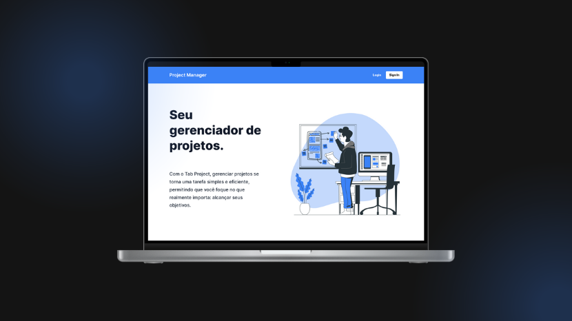

<p align="center">
  
</p>

<p align="center">
  

  

  
</p>

<h1 align="center">
    Project Manager API
</h1>

<br>

## 🧪 Tecnologias

Este projeto foi desenvolvido utilizando as seguintes tecnologias:

- [Node.Js](https://nodejs.org/en)
- [Express.Js](https://expressjs.com/)
- [TypeScript](https://www.typescriptlang.org/)
- [Mongoose](https://mongoosejs.com/)
- [Dotenv](https://www.npmjs.com/package/dotenv)
- [Bcrypt](https://www.npmjs.com/package/bcrypt)
- [Nodemailer](https://www.npmjs.com/package/nodemailer)
- [JWT](https://jwt.io/)
- [Git](https://git-scm.com/)

## 🚀 Executando projeto

Clone o projeto.

```bash
git clone https://github.com/Robson-Carvalho/project-manager-api.git
```

Acsse a pasta do projeto clonado.

```bash
cd project-manager-api
```

Execute o comando abaixo para baixar as dependências do projeto.

```bash
npm install
```

Execute o comando abaixo para rodar o projeto.

```
npm run dev
```

## 📖 Descrição do projeto

Você desenvolvedor, já passou pela situação de criar um portfólio e sempre que precisar remover, adiciona ou atualizar um projeto ter que alterar o código fonte do seu portfólio para fazer tais modificações?

Nesse sentindo eu descidi criar um gerenciador de projetos não só para mim, mas para toda a comunidade o Project Manager. Nele é possível cadastrar as informações mais importantes de nossos projetos, mas e como podemos acessa os projetos cadastrados? Todo usuário do Project Manager terá um link disponível para ter acesso aos seus projetos públicos cadastrados.

## 📝 Licença

Este projeto está licenciado sob a licença MIT. Veja o arquivo [LICENSE](./LICENSE) para mais detalhes.

---

Feito com 💜 por [Robson Carvalho](https://portfolio-robson-carvalho.vercel.app/) 👋
